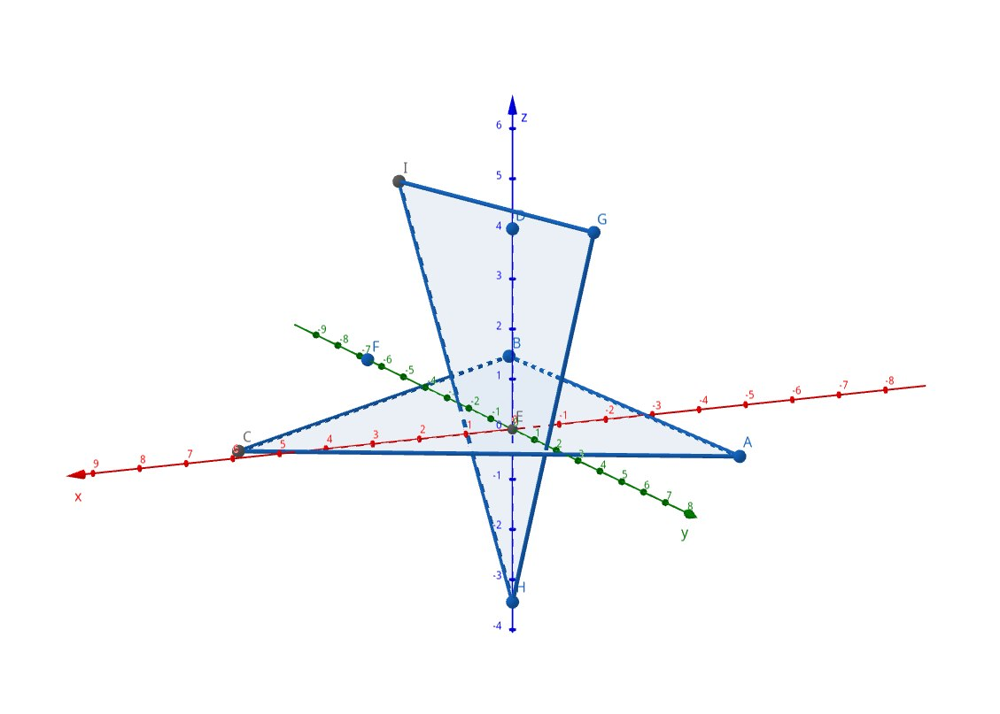

# triangles3D
Вычислительная задача на поиск пересечения треугольников в трехмерном пространстве.



## Сборка
Собрать из исходного кода можно так:
1. Клонировать репозиторий:
```sh
git clone https://github.com/victorbaldin56/triangles3D.git
```
2. Сгенерировать конфигурацию сборки:
```sh
cmake -S . -B build
```
3. Вызвать систему сборки:
```sh
cmake --build build
```

## Использование
В директории `build` соберется исполняемый файл `main`, который необходимо
запустить.

На вход подается число вводимых треугольников $N$, далее
$N$ троек точек. Выход: номера треугольников, которые пересекаются с
любыми другими.
